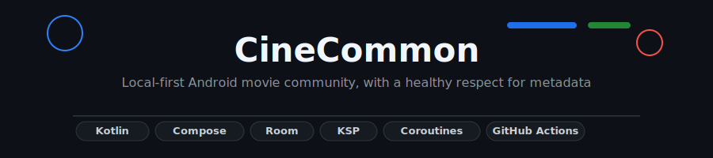
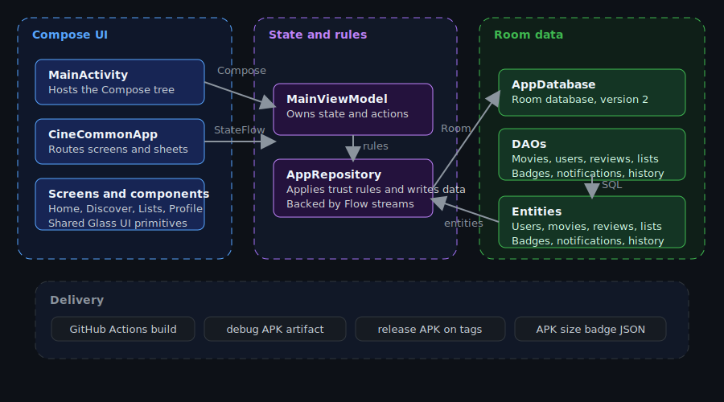
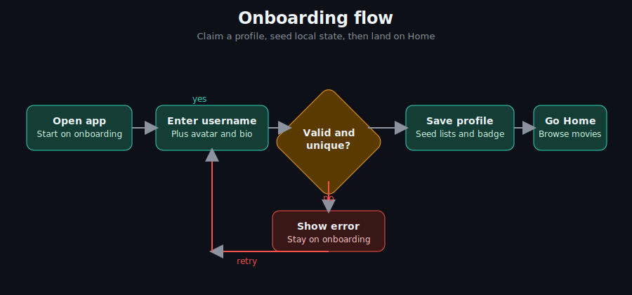

# CineCommon



[](https://github.com/Kaelith69/Glass/releases/latest)
[](https://github.com/Kaelith69/Glass)
[](https://github.com/Kaelith69/Glass/actions/workflows/android-build.yml)
[](https://kotlinlang.org/)
[](https://github.com/Kaelith69/Glass/actions/workflows/android-build.yml)

CineCommon is a local-first Android movie app that keeps the metadata nerding on-device and the drama where it belongs: in the UI.

## What even is this?

CineCommon is a single-activity Jetpack Compose app backed by Room, `StateFlow`, and a deliberately opinionated data model.
The GitHub repo is called `Glass`, but the app itself ships as `CineCommon`.

You get onboarding, home, discover, lists, profile, movie details, reviews, badges, notifications, and community edits without depending on a live runtime backend.

## Why does this exist?

Because movie apps usually stop at posters and star ratings.

CineCommon goes a bit further:

- claim a username once and keep it
- browse and search a local movie catalog
- leave spoiler-aware reviews
- propose metadata edits with trust-based moderation
- build watchlists, wishlists, and custom lists
- unlock badges and keep a small paper trail of what changed

## Features

- one-time profile onboarding with avatar, bio, and taste tags
- Home, Discover, Lists Hub, Profile, and Movie Details screens
- local search across seeded movies and alternate titles
- watchlist and wishlist toggles per user
- custom list creation and pinning
- reviews with upvotes and spoiler flags
- trust-based edit approval with rollback history
- badges, notifications, and motion/accessibility preferences

## Architecture



The app is split into three practical layers: Compose UI, state/rules, and Room persistence.
`MainActivity` hosts the app, `MainViewModel` owns screen state, and `AppRepository` talks to the database.

## How it works



The primary flow is simple: open the app, claim a profile, validate the username, then seed the user’s local setup and land on Home.
If validation fails, onboarding stays in place and shows an error instead of pretending everything is fine. Refreshing honesty, that.

## Tech stack

| Technology | Role | Why we picked it |
| --- | --- | --- |
| Kotlin | App language | Matches the Android toolchain and the rest of the codebase |
| Jetpack Compose | UI | Single-activity reactive UI with less ceremony |
| Material 3 | Components and theme | Gives the app its current cinematic look |
| Navigation Compose | Screen routing | The app uses sealed screen states instead of fragments |
| Room | Local persistence | Stores users, movies, reviews, lists, badges, notifications, and edit history |
| `StateFlow` + Coroutines | State and async work | Keeps UI updates reactive and repository calls structured |
| KSP | Code generation | Used for Room and Moshi codegen |
| Gradle 9.3.1 | Build orchestration | Matches the pinned CI toolchain |
| Android Gradle Plugin 9.1.1 | Android builds | Current Android build plugin in `gradle/libs.versions.toml` |
| GitHub Actions | CI and release | Builds debug APKs, release APKs, and the APK size badge payload |
| JUnit 4, Robolectric, AndroidJUnit4, Espresso | Testing | Covers host-side, Robolectric, and instrumented test paths |
| Secrets Gradle Plugin | Environment loading | Reads `.env` and `.env.example` for secret-style config |

## Getting started

### Prerequisites

- Android Studio
- Android SDK 36
- Gradle 9.3.1 or newer if you build from the command line
- A JDK 17 install for local builds and CI parity

### Installation

```bash
git clone https://github.com/Kaelith69/Glass.git
cd Glass
```

Open the project in Android Studio and let it sync.
If you prefer the terminal, make sure `gradle` is on your `PATH`.

### Configuration

| Variable | Required | Where it appears | Purpose |
| --- | --- | --- | --- |
| `GEMINI_API_KEY` | No | `.env.example` | Placeholder for future Gemini API usage |
| `KEYSTORE_PATH` | No | `app/build.gradle.kts`, GitHub Actions | Optional release signing keystore path |
| `STORE_PASSWORD` | No | `app/build.gradle.kts`, GitHub Actions | Optional release keystore password |
| `KEY_PASSWORD` | No | `app/build.gradle.kts`, GitHub Actions | Optional release key password |

If the signing variables are missing, the release pipeline still produces an APK artifact; it just skips signing.

### Running locally

```bash
gradle :app:assembleDebug
gradle :app:test
gradle :app:lint
```

```bash
gradle :app:assembleRelease
```

The release command is only useful if your signing variables are set up.

## Usage

1. Claim a unique username during onboarding and land on Home.
2. Search the catalog in Discover and open a movie’s details page.
3. Submit a spoiler-aware review and upvote other reviews.
4. Add movies to Watchlist or Wishlist, then group them into custom lists.
5. Propose metadata edits and let trust score decide whether they auto-approve or go to moderation.

## Use cases

- personal movie tracker with offline-friendly state
- community-curated metadata playground
- Compose + Room architecture demo
- review and list manager for testers or prototype users

## Project structure

```text
.
├── app/                          # Android application module
│   └── src/
│       ├── main/java/com/example # Main app code
│       │   ├── MainActivity.kt   # Entry activity and Compose host
│       │   ├── data/             # Room database, DAOs, entities, repository
│       │   └── ui/               # ViewModel, screens, components, theme
│       ├── main/res/             # Android resources and launcher assets
│       ├── test/                 # Host-side unit and Robolectric tests
│       └── androidTest/          # Instrumented tests
├── docs/assets/                  # README SVGs used by this rewrite
├── docs/readme/                  # Legacy docs assets and badge payloads
├── .github/workflows/            # Build, release, and badge automation
├── gradle/libs.versions.toml     # Version catalog for dependencies and plugins
├── build.gradle.kts              # Root plugin declarations
├── settings.gradle.kts           # Repository and module settings
└── metadata.json                 # Project metadata used by tooling
```

## API reference

### `com.example.MainActivity`

- `Screen` — sealed navigation state with `Onboarding`, `Home`, `Discover`, `ListsHub`, `Profile`, and `MovieDetails(movieId)`
- `CineCommonApp(viewModel)` — top-level Compose host that switches screens and opens notifications

### `com.example.ui.MainViewModel`

State streams:

- `currentUsername`
- `currentUser`
- `allMovies`
- `selectedMovie`
- `selectedMovieReviews`
- `selectedMovieEditHistory`
- `searchQuery`
- `searchResults`
- `allBadges`
- `allLists`
- `userMovieLists`
- `notifications`
- `pendingEdits`
- `allEditHistory`
- `watchlistStates`
- `wishlistStates`

Actions:

- `performSearch(query)`
- `selectMovie(id)`
- `selectPublicProfile(username)`
- `claimProfileOnboarding(usernameStr, emailStr, avatarEmoji, avatarColor, bio, selectedTags)`
- `signOut()`
- `submitMovieReview(movieId, rating, reviewText, isSpoiler)`
- `upvoteReview(movieId, author)`
- `contributeMovieUpdate(movieId, plot, cast, altTitles, director, trivia, tags, posterUrl, summaryOfChanges)`
- `approveEdit(historyId)`
- `rejectEdit(historyId, reason)`
- `rollbackToEditHistory(movieId, historyItem)`
- `createMovieCard(title, releaseYear, director, plot, genres, cast, altTitles, poster)`
- `toggleWatchlist(movieId)`
- `toggleWishlist(movieId)`
- `refreshWatchWishStates(movieId)`
- `createCustomMovieList(name, description, movieIdsStr)`
- `togglePinCustomList(listId)`
- `toggleBadgePin(badgeId)`

### `com.example.data`

- `AppRepository` — wraps Room, applies trust rules, and exposes flows
- `AppDatabase` — Room database with version 2
- `Daos.kt` — `MovieDao`, `UserDao`, `ReviewDao`, `MovieListDao`, `BadgeDao`, `NotificationDao`, `EditHistoryDao`
- `Models.kt` — `UserEntity`, `MovieEntity`, `ReviewEntity`, `MovieListEntity`, `BadgeEntity`, `NotificationEntity`, `MovieEditHistoryEntity`

There are no REST routes or CLI commands in the current app path; the public surface is Kotlin/Compose plus Room-backed state.

## Development

### Running tests

```bash
gradle :app:test
gradle :app:lint
```

For a quick build sanity check:

```bash
gradle :app:assembleDebug
```

### Contributing

- keep app code under `app/src/main/java/com/example`
- keep README diagrams in `docs/assets`
- keep workflows in `.github/workflows`
- run `gradle :app:test` and `gradle :app:lint` before opening a PR

## Roadmap

- [ ] Add published coverage reporting
- [ ] Replace example tests with feature-level tests
- [ ] Expand release notes automation
- [ ] Keep APK publishing wired to GitHub Releases
- [ ] Continue polishing onboarding and moderation flows

## License

No LICENSE file is present in the repository right now.

---

Built by [Kaelith69](https://github.com/Kaelith69).
