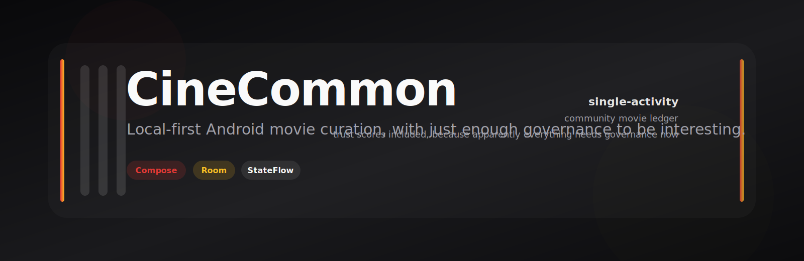
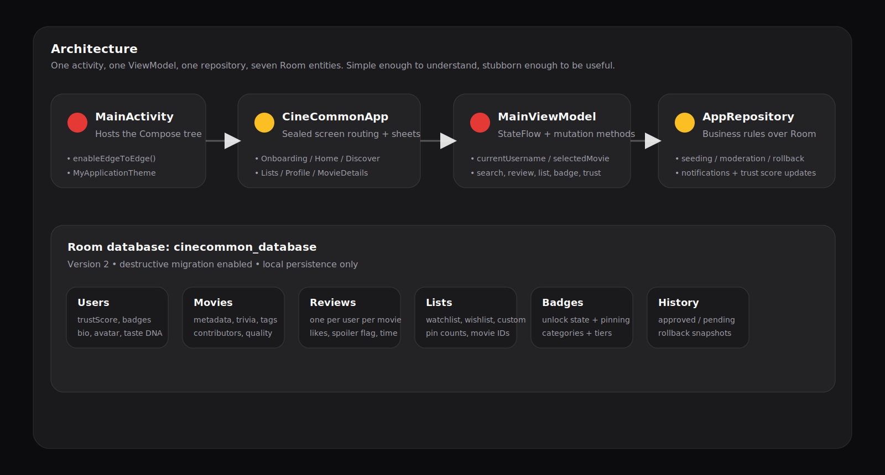
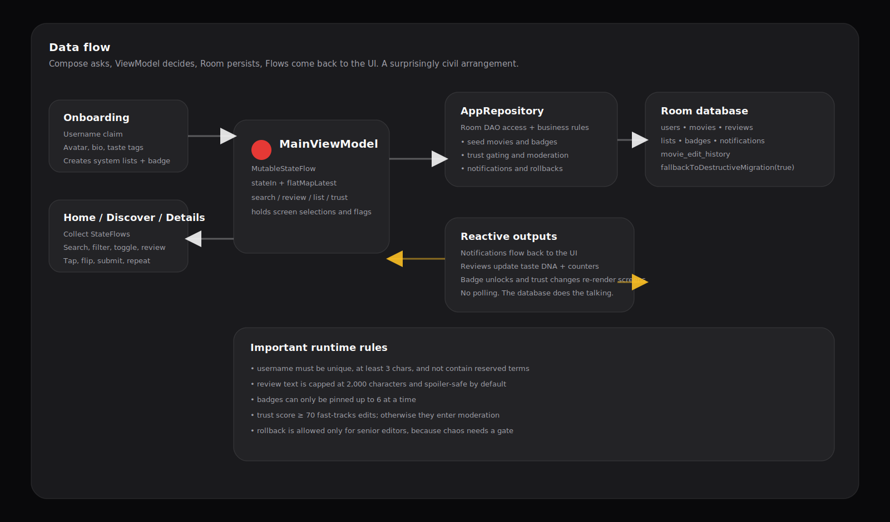
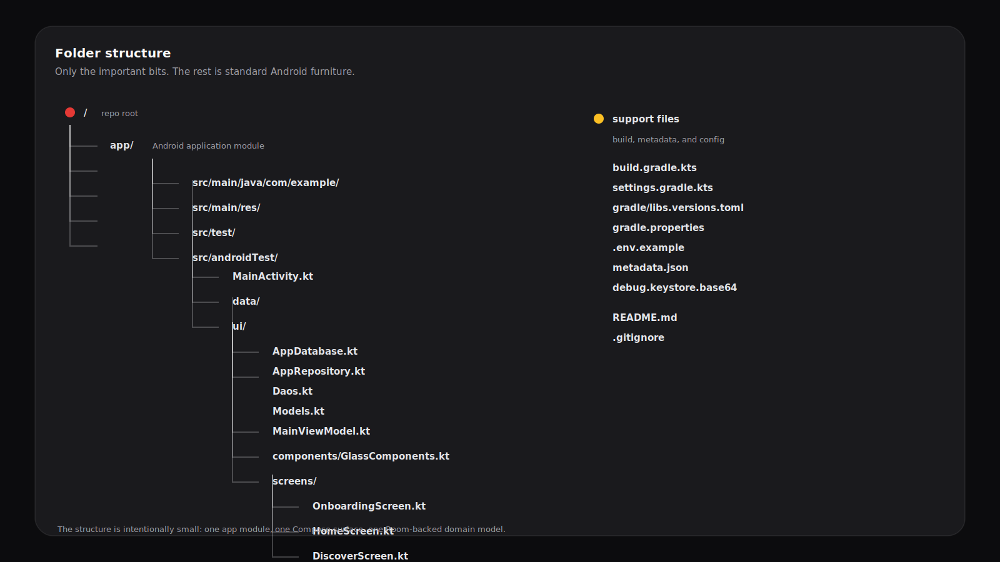
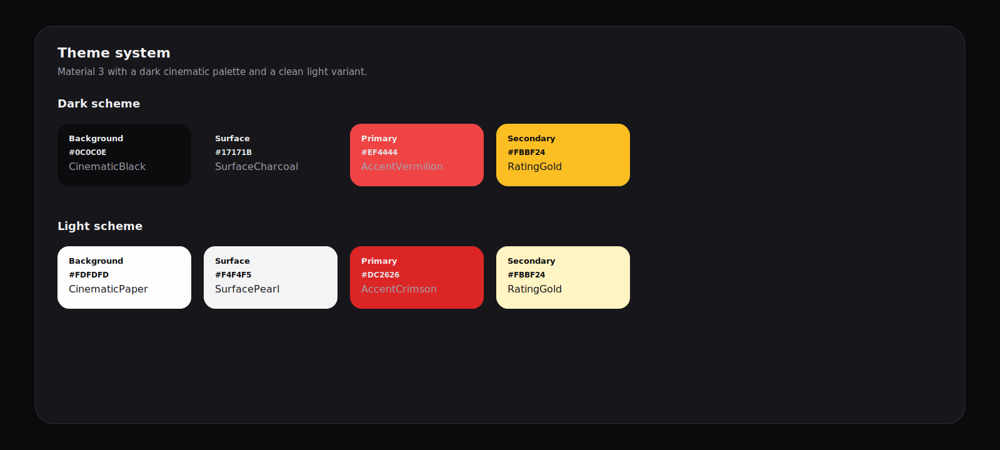

# CineCommon

  

> A local-first Android movie app for people who treat metadata like a civic duty.

## What this is

CineCommon is a single-activity Jetpack Compose app backed by Room, StateFlow, and a small amount of trust-based bureaucracy.
It lets users claim a profile, browse seeded films, search and filter the catalog, submit reviews, propose metadata edits, manage watchlists, and curate community lists.

The app is deliberately local-first: the current code path stores its state in Room and does not make runtime network calls.
Some dependencies in the build file are future-facing rather than active. Ambition is cheap; wiring is work.

## Download

- [Latest APK release](https://github.com/Kaelith69/Glass/releases/latest/download/app-release.apk)
- [All releases](https://github.com/Kaelith69/Glass/releases)

## Why it exists

Because movie apps usually stop at “here is a poster.”
CineCommon goes further:

- identity is a one-time username claim
- reviews are capped and spoiler-aware
- edits can be auto-approved or queued for moderation based on trust
- badges unlock as users contribute
- lists, notifications, and rollback history all live in the same shared universe

## Core features

- **Onboarding** — unique username claim, avatar selection, bio, and taste tags
- **Home** — taste snapshot, curated picks, badge highlights, and notification access
- **Discover** — search, genre filters, interactive flip cards, and movie-card proposals
- **Movie details** — deep metadata, review logging, watchlist/wishlist toggles, and rollback history
- **Lists Hub** — personal system lists plus community-built catalogs
- **Profile DNA** — trust score, pinned badges, moderation queue, and accessibility prefs
- **Community data model** — review likes, badge unlocks, edit history, and notifications

## Architecture

  

### System map

- `MainActivity` hosts one Compose tree.
- `CineCommonApp` controls screen switching with a sealed `Screen` state.
- `MainViewModel` owns all app state and mutation entry points.
- `AppRepository` wraps Room and the business rules.
- `AppDatabase` persists users, movies, reviews, lists, badges, notifications, and edit history.

## Data flow

  

### What moves where

- onboarding claims a username and seeds the user’s watchlist, wishlist, and starter badge
- `StateFlow` streams feed each screen from the repository
- search and create/edit actions flow through the ViewModel
- repository methods write to Room and emit notifications, trust-score changes, and badge unlocks
- detail screens read the updated flows back out, because the app politely believes in synchronization

## Folder structure

  

## Theme system

  

The visual language is cinematic, dark by default, and mildly dramatic in a way Compose apps rarely need but often deserve.

## Tech stack

**Runtime**
- Kotlin
- Jetpack Compose
- Material 3
- Navigation Compose
- Room
- Kotlin Coroutines / Flow / StateFlow

**Build**
- Android Gradle Plugin 9.1.1
- Kotlin 2.2.10
- KSP
- Version catalog (`gradle/libs.versions.toml`)

**Testing**
- JUnit 4
- Robolectric
- Compose UI test
- Roborazzi

**Declared but currently idle**
- Retrofit
- OkHttp
- Moshi
- Coil
- Firebase AI
- CameraX
- Datastore

## Setup

### Prerequisites

- Android Studio
- An Android SDK compatible with `compileSdk 36` / `targetSdk 36`
- A local Gradle installation if you plan to build outside Android Studio

### Local run

1. Open the repository in Android Studio.
2. Let Android Studio sync the Gradle project.
3. If you build from the command line, make sure your local toolchain can resolve AGP 9.1.1.
4. Launch the app on an emulator or device.

### Environment variables

The current app code does **not** read runtime secrets, but the repo is wired for them:

- `.env` / `.env.example` are configured for the Secrets Gradle Plugin.
- `GEMINI_API_KEY` exists as a placeholder for future Gemini usage.
- Release signing expects:
  - `SIGNING_KEY` (base64-encoded keystore contents, decoded by CI)
  - `STORE_PASSWORD`
  - `KEY_PASSWORD`
  - `ALIAS` if you want to override the default signing alias (`upload`)
  - `KEYSTORE_PATH` is supplied by the release workflow and points to the decoded keystore file

## How it works

### State management

`MainViewModel` is the center of gravity.
It holds:

- current username
- selected movie
- focused public profile
- search query and results
- watchlist / wishlist state maps
- notifications
- pending edits
- badge and list streams
- accessibility and preference toggles

Most screen data is exposed as `StateFlow`, then collected in Compose.
That keeps the UI reactive without pretending we need a more complicated story.

### Database

Room database: `cinecommon_database`

Entities:

- `UserEntity`
- `MovieEntity`
- `ReviewEntity`
- `MovieListEntity`
- `BadgeEntity`
- `NotificationEntity`
- `MovieEditHistoryEntity`

Notable rules:

- usernames are unique and filtered against reserved terms
- reviews are capped at 2,000 characters
- badges can be pinned up to 6 per profile
- trust scores range from 0 to 100
- edits are auto-approved at trust score 70+
- `fallbackToDestructiveMigration(true)` is enabled, so schema changes reset local data

### Seeding and moderation

- Five films are pre-seeded on first launch if they are not already present.
- Review activity updates user stats and taste DNA.
- New edits can be queued for review or applied instantly depending on trust.
- Rollbacks require senior-editor trust.

## Scripts and validation

The repository includes a Gradle wrapper for CI and local command-line builds.
That means the most reliable path is Android Studio sync/run, or `./gradlew` from the project root.

I also checked the build in this environment:

- `gradle test` currently fails during plugin resolution for `com.android.application` version `9.1.1`

So the docs are honest, if not glamorous.

## Security and privacy

- No runtime permissions are requested in the manifest.
- No current app code sends data off-device.
- Sign-in is profile-based, not account-based.
- Release signing uses environment variables rather than hard-coded secrets.

## Known repo notes

- The root project name is still `My Application`.
- The README now reflects the actual app instead of the AI Studio starter boilerplate.
- The build declares several future-facing libraries that are not yet wired into the app path.

## License

No license file is present.
For an open-source release, **MIT** is the simplest default; **Apache-2.0** is the safer pick if you want a patent grant in the room.
